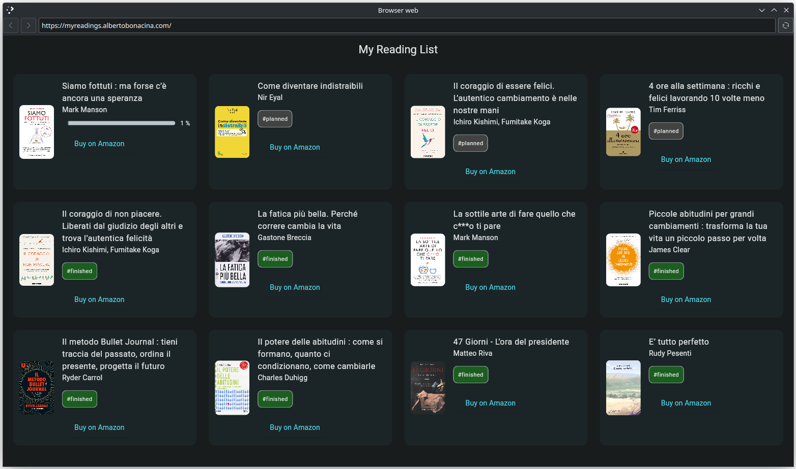
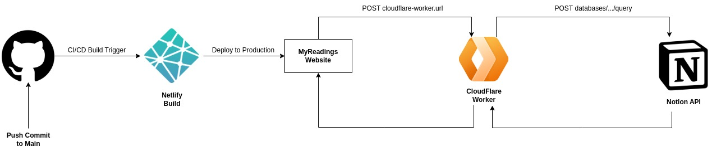
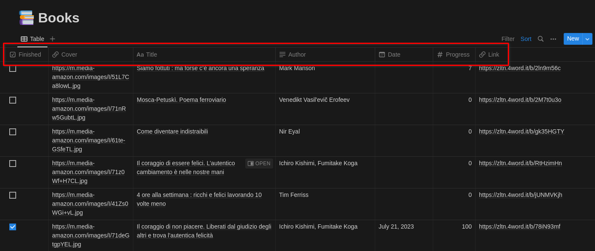
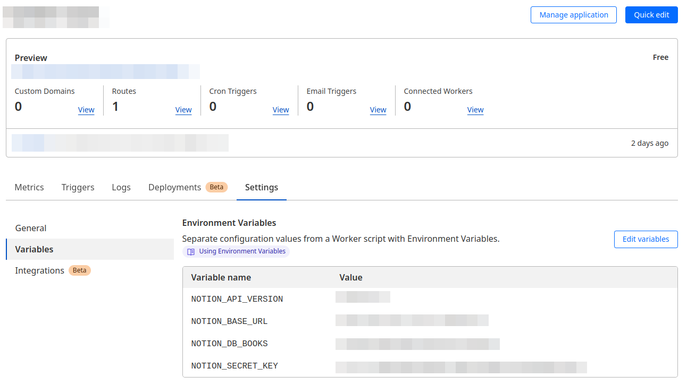
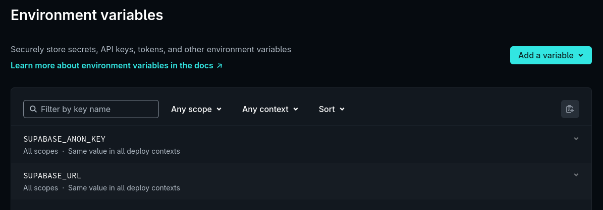
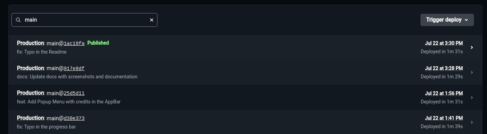

<div align="center">
  <h1>My Readings with Flutter on the Web</h1>
  <p align="center">
  <a href="https://dart.dev/"></a>
  <a href="https://flutter.dev/"></a>
  <a href="https://www.apache.org/licenses/LICENSE-2.0.html"></a>
  <a href="https://www.netlify.com/"></a>
  <a href="https://www.cloudflare.com/"></a>
  </p>
</div>



The purpose of this application is to create a dashboard where you can share the books you have read, future books, and track the progress of those being read.

The application currently allows you to view books that have been saved in a [Notion](https://www.notion.so/) database and shows them on a web page, so it does not allow books to be added, edited or deleted. 

Since Notion API cannot be called directly from a web page a [CloudFlare Worker](https://workers.cloudflare.com/) was created as middleware between the web page and the API, whose code is in the file `cloudflare/worker.js`.

You can read the blog post on my blog here: [Boosting Productivity: A Guide to Building a Reading List App with Notion and Flutter Web](https://blog.albertobonacina.com/boosting-productivity-a-guide-to-building-a-reading-list-app-with-notion-and-flutter-web)

## 🧬 Project Structure

To better understand how the application is organized an outline of its architecture is given, and the individual parts will be described in the dedicated sections:



### 📚 Notion Database

A [Notion database](https://www.notion.so/help/category/databases) with these characteristics was used to save the list of books and their characteristics:



In order to read the information within the database we must then create a Notion application, called [Integration](https://developers.notion.com/docs/create-a-notion-integration), to which we must give read privileges to the database. Once the application is created we will be given a secret in the form `secret_XXXX` which we must use later to interact with the API and take information from our database.

To make interaction with the Notion API easier, it is useful to pin these variables that will be used later in the Cloudflare Worker:

* NOTION_API_VERSION: `2022-06-28`
* NOTION_BASE_URL: in our case is `https://api.notion.com/v1/databases`
* NOTION_DB_BOOKS: it can be found by going to look at the url of the Notion pages where the database is located
* NOTION_SECRET_KEY: `secret_XXXX`, found on the Integration page

### ⚙️ CloudFlare Worker

A CloudFlare Worker was used between the web page and the Notion API because calling the Notion API directly from the web page returned a CORS error, here some discussion on StackOverflow:

* [Notion API, Vanilla JS, Fetch does not work [duplicate]](https://stackoverflow.com/questions/68781041/notion-api-vanilla-js-fetch-does-not-work)
* [Can I use fetch to call the Notion API?](https://stackoverflow.com/questions/68015381/can-i-use-fetch-to-call-the-notion-api)

The worker code is in the file `cloudflare/worker.js` where [environment variables](https://developers.cloudflare.com/workers/configuration/environment-variables/) have also been managed to safely include the worker code in the repo.



The code in the `worker.js` is very very simplified and has been adapted for this particular case, for more generic solutions or to wrap Notion's api in those of the worker you can refer to these two repos on GitHub:

* [sebtoombs/notion-api-worker](https://github.com/sebtoombs/notion-api-worker): Notion API Worker is a Cloudflare worker to wrap & cache the public Notion API.
* [splitbee/notion-api-worker](https://github.com/splitbee/notion-api-worker): A serverless wrapper for the private Notion API. It provides fast and easy access to your Notion content. Ideal to make Notion your CMS.

### 🔮 Netlify Build

In order to have a complete environment that allows me, with each push on main, to have an automatic deployment in production I relied on [Netlify](https://www.netlify.com/) where I created a new site and configured in their dashboard the domain to which the build responds, had Netlify generate an SSL certificate with Let's Encrypt to have my site available under https, created the [environment variables](https://docs.netlify.com/environment-variables/overview/) and set up the file that it has to read to run the build whose code is in the file `netlify.toml`. 



Netlify already provides an integration for building a Flutter web app with the [Flutter SDK](https://www.netlify.com/integrations/community-built/flutter-sdk-build-plugin/) plugin that you can install with a single click on your site, the project repo can be found here: [Netlify Flutter Build Plugin](https://github.com/bencevans/netlify-plugin-flutter). 

With all this configured each push on main automatically triggers a build that if correct that is released directly to production within a few minutes.




### 🚀 Run Project

To run the project you have to pass some environment variables as described here: [How to Store API Keys in Flutter: --dart-define vs .env files](https://codewithandrea.com/articles/flutter-api-keys-dart-define-env-files/), in my case I opted for passing the key using `--dart-define` as it is easily integrated with CI/CD tools. This can be done in two ways:

* pass individual variables to the build command with `--dart-define MY_VARIABLE=value`, a choice that is later used in Netlify to create the release build
* pass a file with the variables with `--dart-define-from-file=api-keys.json`, a more convenient choice when developing locally

In the first case the command is:

```bash
flutter run --dart-define MY_VARIABLE=value
```

In the second case, on the other hand, you have to go and create a file called `api-keys.json` to put in the root of the project, with this content:

```json
{
  "MY_VARIABLE": "value"
}
```

and then pass it like this:

```bash
flutter run --dart-define-from-file=api-keys.json
```

Within the app you can then take the reference to the environment variable in this way:

```dart
const myEnvironmentValue = String.fromEnvironment('MY_VARIABLE');
```

In my case the variable that is passed at build time, and which is also specified in the `netlify.toml` file is `WORKER_URL` which is given to me by Cloudflare when I create the worker in its dashboard.

## 💎 Contributing

If you have any idea, feel free to fork it and submit your changes back to me.

## 📃 License

```
Copyright 2023 Alberto Bonacina

Licensed under the Apache License, Version 2.0 (the "License");
you may not use this file except in compliance with the License.
You may obtain a copy of the License at

   http://www.apache.org/licenses/LICENSE-2.0

Unless required by applicable law or agreed to in writing, software
distributed under the License is distributed on an "AS IS" BASIS,
WITHOUT WARRANTIES OR CONDITIONS OF ANY KIND, either express or implied.
See the License for the specific language governing permissions and
limitations under the License.
```